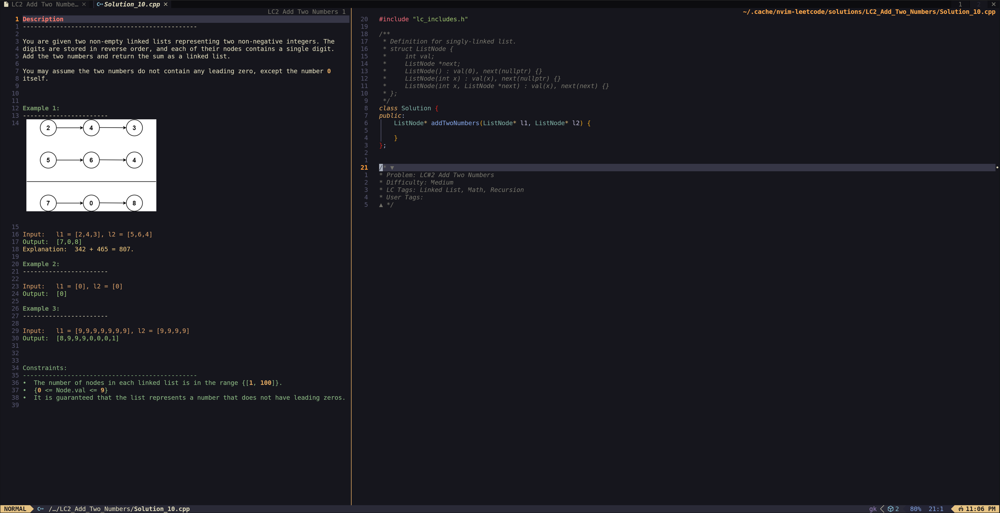

# LeetNeoCode

_A distraction‑free way to fetch, read and solve LeetCode problems **inside Neovim**._



> **Note** – This plugin **does not compile or run your code** against LeetCode's judge.
> If you need in‑editor execution and submission, check out
> [`kawre/leetcode.nvim`](https://github.com/kawre/leetcode.nvim).

---

## Features

- Open a problem description side‑by‑side with starter code
- Highlighted, nicely wrapped markdown with optional inline images<sup>†</sup>
- Per‑problem solution folder with automatic versioning (`Solution_1.cpp`, `Solution_2.cpp`, …)
- **Zero-padded problem numbering** for clean organization (`LC00001_Two_Sum`, `LC00056_Merge_Intervals`)
- **Recent solutions management** with configurable quick access to your most worked-on problems
- Metadata comment (difficulty, tags, your own tags) folded at the bottom of every file
- Support for multiple programming languages (C++, Python, Java, JavaScript, Go, and more)
- Automatic code dependencies setup with appropriate language-specific helpers
- Customizable UI with configurable colors, formatting, and display options

<sup>†</sup> Images render only if you use a _Kitty‑protocol_ terminal and have [`image.nvim`](https://github.com/3rd/image.nvim) installed; otherwise we show lightweight placeholders.

---

## Dependencies

### Required

- **Neovim ≥ 0.11** – [neovim.io](https://neovim.io)
- **curl** in your `$PATH` – Usually pre-installed on most systems

### Image Support (optional)

For inline images in problem descriptions, you'll need:

1. **[image.nvim](https://github.com/3rd/image.nvim)** – Neovim plugin for displaying images
2. **A terminal with [Kitty graphics protocol](https://sw.kovidgoyal.net/kitty/graphics-protocol/) support:**
   - [Kitty](https://sw.kovidgoyal.net/kitty/) (recommended)
   - [WezTerm](https://wezfurlong.org/wezterm/)
   - [iTerm2](https://iterm2.com/) (macOS only)
3. **Backend dependencies:**
   - **[ImageMagick](https://imagemagick.org/)** + dev library – `sudo apt install imagemagick libmagickwand-dev`
   - **[LuaRocks](https://luarocks.org/)** – `sudo apt install luarocks`
   - **[magick](https://github.com/leafo/magick)** Lua rock – `luarocks --local --lua-version=5.1 install magick`

Image support is optional. If your terminal does not support images or you don't want them, a text placeholder will be used instead.

### Automated Setup (Optional)

The plugin includes scripts to automate dependency installation. These helper scripts will guide you through installing all necessary components for image support:

```bash
# From your plugin directory:
cd installation
./install_image_support.sh
```

This interactive installer will:

- Check for and optionally install Kitty terminal
- Offer to install a basic Kitty configuration
- Install ImageMagick, libmagickwand-dev, LuaRocks, and the magick Lua rock
- Configure your shell environment with the necessary LuaRocks paths

If you prefer to install dependencies manually, you can use the individual commands listed in the Image Support section above.

---

## Installation

### lazy.nvim

```lua
{
  "paulburgess1357/LeetNeoCode",
  dependencies = {
    -- Optional: only needed if you want inline images
    { "3rd/image.nvim", optional = true },
  },
  config = function()
    require("LeetNeoCode").setup()
  end,
}
```

### packer.nvim

```lua
use({
  "paulburgess1357/LeetNeoCode",
  requires = {
    -- Optional: only needed if you want inline images
    { "3rd/image.nvim", opt = true },
  },
  config = function()
    require("LeetNeoCode").setup()
  end,
})
```

---

## Configuration

All options (with defaults) – copy the block and tweak what you need:

```lua

return {
  "paulburgess1357/LeetNeoCode",
  enabled = true,
  branch = "master",

  -- only load when the user runs :LC
  cmd = { "LC" },

  -- mark image.nvim optional so it's only loaded if images are enabled
  dependencies = {
    { "3rd/image.nvim", optional = false },
  },

  opts = {
    -------------------------------------------------------------------------
    -- Core settings
    -------------------------------------------------------------------------
    default_language = "cpp", -- valid values: cpp, python, java, javascript, go, rust, swift, csharp
    code_only = false, -- when true, only display code.  When false, show both description and code.

    -- Storage paths ----------------------------------------------------------
    cache_dir = vim.fn.stdpath("cache") .. "/LeetNeoCode",
    cache_subdir = "meta",
    cache_file = "leetcode_cache.json",
    cache_expiry_days = 14,
    solutions_subdir = "solutions",
    solutions_recent_subdir = "solutions_recent", -- directory for recent solutions
    images_subdir = "images",

    API_URL = "https://leetcode.com/api/problems/all/",

    -------------------------------------------------------------------------
    -- Recent Solutions Management
    -------------------------------------------------------------------------
    recent_solutions_count = 10, -- number of recent solutions to keep in recent directory

    -------------------------------------------------------------------------
    -- Notification timing
    -------------------------------------------------------------------------
    notify_wait_timeout = 50, -- ms to keep notifier visible
    notify_wait_interval = 10, -- ms polling interval inside vim.wait

    -------------------------------------------------------------------------
    -- Window layout
    -------------------------------------------------------------------------
    description_split = 0.35,

    -------------------------------------------------------------------------
    -- Hard‐wrap options
    -------------------------------------------------------------------------
    enable_custom_wrap = true,
    custom_wrap_offset = 0.02,

    -------------------------------------------------------------------------
    -- Metadata toggles
    -------------------------------------------------------------------------
    include_problem_metadata = true,
    include_leetcode_tags = true,
    include_user_tags = true,
    metadata_at_bottom = true,
    metadata_comment_style = "multi", -- "multi" or "single"

    -------------------------------------------------------------------------
    -- Color palette
    -------------------------------------------------------------------------
    colors = {                -- change any of these to suit your colorscheme
      problem_title           = "#ff7a6c",
      problem_section         = "#d8a657",
      problem_constraints     = "#89b482",
      problem_constraint_num  = "#d8a657",
      problem_followup        = "#d8a657",
      problem_example         = "#a9b665",
      problem_bullet          = "#d3869b",
      problem_input           = "#d19a66",
      problem_output          = "#98c379",
      problem_explanation     = "#e5c07b",
      problem_math            = "#d3869b",
      problem_number          = "#d8a657",
      problem_superscript     = "#d8a657",
      problem_variable        = "#7daea3",
      problem_code_block      = "#e6c07a",

      metadata_line           = "#d8a657",
      difficulty_line         = "#a9b665",
      tags_line               = "#7daea3",
      user_tags_line          = "#e78a4e",
    },
    -------------------------------------------------------------------------
    -- Image handling
    -------------------------------------------------------------------------
    enable_images = true,
    use_direct_urls = true,
    image_render_delay = 100,

    -- Fixed size options (set to nil to use percentages instead)
    image_max_width = nil,
    image_max_height = nil,

    -- Percentage-based sizing (percentage of window dimensions)
    image_max_width_pct = 40, -- 80% of window width
    image_max_height_pct = 30, -- 60% of window height

    image_right_after_separator = true,
    image_preserve_aspect_ratio = true,
    image_auto_render_on_win_focus = true,

    -- which terminals to probe for inline‐image support
    image_terminals = {
      { var = "TERM", match = "kitty" },
      { var = "KITTY_WINDOW_ID" },
    },

    -- whether to show a one‐time popup about image support at startup
    notify_on_image_support = true,

    -------------------------------------------------------------------------
    -- Code‐block markers & style
    -------------------------------------------------------------------------
    code_block_start = "{",
    code_block_end = "}",
    code_block_color = theme_config.leetcode.problem.code_block, -- Use the same code block color
    code_block_style = "italic",

    ---------------------------------------------------------------------------
    -- Misc
    ---------------------------------------------------------------------------
    smart_copy = true, -- When true, excludes includes and metadata when copying
    smart_copy_color = "#34C759",

  config = function(_, opts)
    -----------------------------------------------------------------------
    -- if images are enabled, configure image.nvim (Kitty backend)
    -----------------------------------------------------------------------
    if opts.enable_images then
      local ok, img = pcall(require, "image")
      if ok then
        img.setup({
          backend = "kitty",
          processor = "magick_cli", -- Add processor for better image handling
          max_width = opts.image_max_width,
          max_height = opts.image_max_height,
          max_width_window_percentage = opts.image_max_width_pct,
          max_height_window_percentage = opts.image_max_height_pct,
          integrations = { markdown = { enabled = false } },
        })
      end
    end

    -----------------------------------------------------------------------
    -- initialize LeetNeoCode with all options
    -----------------------------------------------------------------------
    require("LeetNeoCode").setup(opts)
  end,
}
```

### Language identifier

`default_language` accepts the LeetCode _slug_ for the language you want your starter code in:

| Value          | Language        | File extension |
| -------------- | --------------- | -------------- |
| `"cpp"`        | C++17/20/23     | `.cpp`         |
| `"python"`     | Python 3        | `.py`          |
| `"java"`       | Java 17         | `.java`        |
| `"javascript"` | ECMAScript 2021 | `.js`          |
| `"go"`         | Go 1.20         | `.go`          |
| `"rust"`       | Rust            | `.rs`          |
| `"swift"`      | Swift           | `.swift`       |
| `"csharp"`     | C#              | `.cs`          |

---

## Usage

| Command            | Action                                                                         |
| ------------------ | ------------------------------------------------------------------------------ |
| `:LC Pull`         | (re‑)download the full problem list into the cache                             |
| `:LC <number>`     | Open Problem – if the cache is stale it is refreshed first                     |
| `:LC Copy`         | Smart Copy: Excludes `includes/imports` and folded comment section from buffer |
| `:LC Recent`       | Pull the code for your most recent worked on solution                          |
| `:LC Recent Store` | Update recent solutions directory with N most recent problem folders           |
| `:LC Recent List`  | Display a list of recent solutions with timestamps                             |

### Alternative Command Formats

All commands support multiple formats for convenience:

| Spaced Commands    | Single-word Commands | Standalone Commands |
| ------------------ | -------------------- | ------------------- |
| `:LC Recent`       | `:LC Recent`         | `:LCRecent`         |
| `:LC Recent Store` | `:LC RecentStore`    | `:LCRecentStore`    |
| `:LC Recent List`  | `:LC RecentList`     | `:LCRecentList`     |
| `:LC Pull`         | `:LC Pull`           | `:LCPull`           |
| `:LC Copy`         | `:LC Copy`           | `:LCCopy`           |

### Typical workflow 📚 (no execution, just editing)

1. `:LC Pull` – fetch metadata (run again occasionally to refresh)
2. `:LC 1` – opens "**Two Sum**" in a new tab: left‑pane description, right‑pane `Solution_1.cpp`
3. Solve the problem locally.
4. `LC Copy` (or yank the full file if `smart_copy = true`); Paste into the Leetcode code section.
5. Need another attempt? Run `:LC 1` again and you'll get `Solution_2.cpp`
6. **Manage recent work**: Use `:LC Recent Store` to copy your 10 most recent problems to a separate directory
7. **Quick access**: Use `:LC Recent List` to see your recent work with timestamps
8. Grep or Telescope through `solutions/` when you want to revisit old work
9. Want to view your most recent code? Type `LC Recent` to quickly pull in your most recent, worked on solution.

---

## File Layout

```
~/.cache/LeetNeoCode/
├── meta/
│   └── leetcode_cache.json
├── solutions/
│   ├── LC00001_Two_Sum/
│   │   ├── Solution_1.cpp
│   │   ├── Solution_2.cpp
│   │   ├── lc_includes.h -> symlink to plugin/dependencies
│   │   └── .clang-format
│   ├── LC00056_Merge_Intervals/
│   │   ├── Solution_1.cpp
│   │   └── lc_includes.h -> symlink to plugin/dependencies
│   └── LC00015_3Sum/
│       ├── Solution_1.cpp
│       └── lc_includes.h -> symlink to plugin/dependencies
└── solutions_recent/
    ├── LC00056_Merge_Intervals/     # Copy of most recent
    │   ├── Solution_1.cpp
    │   └── lc_includes.h
    ├── LC00001_Two_Sum/             # Copy of 2nd most recent
    │   ├── Solution_1.cpp
    │   ├── Solution_2.cpp
    │   └── lc_includes.h
    └── LC00015_3Sum/                # Copy of 3rd most recent
        ├── Solution_1.cpp
        └── lc_includes.h
```

_(Example for C++ – other languages get their own helper files.)_

### Recent Solutions Management

The plugin provides a dedicated recent solutions system:

- **Zero-padded numbering**: All problem folders use 5-digit zero-padded format (`LC00001_`, `LC00056_`, etc.) for clean alphabetical sorting
- **Configurable count**: Set `recent_solutions_count` to control how many recent problems to track (default: 10)
- **Separate directory**: Recent solutions are copied to `solutions_recent/` without affecting your main solutions
- **Automatic updates**: Use `:LC Recent Store` to refresh the recent directory with your most recently modified problems
- **Quick overview**: Use `:LC Recent List` to see formatted list with timestamps and problem details

---

## Features in Detail

### Syntax Highlighting

The plugin provides custom syntax highlighting for:

- Problem descriptions with color-coded sections
- Example input/output blocks
- Code snippets within problem descriptions
- Tags and metadata in solution files

### Auto-folding Metadata

Solution files include problem metadata as comments that are:

- Automatically folded when opening the file
- Placed at the bottom of the file for minimal distraction
- Contain problem number, title, difficulty, and LeetCode tags
- Include a section for your own custom tags

### Image Rendering

If you've set up image support:

- Problem diagrams and illustrations display directly in Neovim
- Images automatically resize based on your window dimensions
- Rendering is optimized for Kitty-protocol compatible terminals
- Images re-render when switching back to the window

### Multiple Languages

The plugin supports all LeetCode-offered languages with:

- Language-specific starter code templates
- Appropriate file extensions and syntax highlighting
- Language-specific include/import statements
- Proper formatting configuration (.clang-format, .editorconfig, etc.)

### Organization & File Structure

- **Zero-padded problem numbers**: All directories use format `LC00001_Problem_Name` for consistent sorting
- **Automatic versioning**: Multiple solution attempts are numbered (`Solution_1.cpp`, `Solution_2.cpp`)
- **Recent solutions tracking**: Configurable recent solutions directory for quick access to your latest work
- **Language-specific dependencies**: Automatic setup of include files, linters, and formatters per language

---

## License

[The Unlicense](https://unlicense.org/) – public domain, no strings attached.

---

## Contributions

Contributions welcome :)
